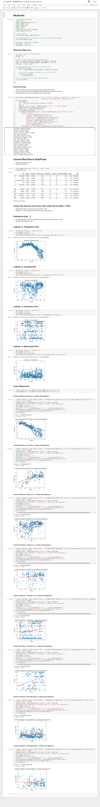
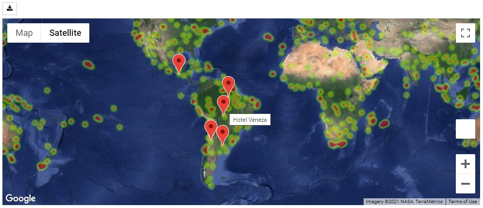
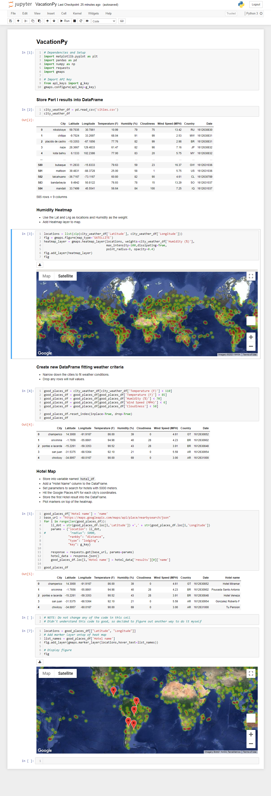

# Python API Homework - What's the Weather Like?

## Part I - WeatherPy
* For Part I, you must include a written description of three observable trends based on the data:

1 - With r-value == -0.87 with sertanty we can say, that temperature in northern hemisphere deppends on latitude.

2 - For some reason relation in southern hemisphire is not that strong, only r-value == 0.62.

3 - The rest of the weather factors barely, if at all relates to latitude with r-value all below 0.4.

4 - Big portion of Cloudiness data groupes together around 99%, 75% and 0% - this is probably a result of masurment and recording medods used.

### Part II - VacationPy

* For Part II, you must include a screenshot of the heatmap you create and include it in your submission:

